# Proje Yönetim Yazılımı

Bu proje, kullanıcıların projelerini, görevlerini ve çalışanlarını kolayca yönetebilmelerini sağlamak amacıyla geliştirilmiş bir **Proje Yönetim Yazılımı**dır. Yazılım, Java Swing ve MySQL kullanılarak geliştirilmiştir.

---

## Geliştirici Ekip

 <table>
    <tr>
      <th>İsim</th>
      <th>Görev</th>
      <th>İletişim</th>
    </tr>
    <tr>
      <td>Baran Ar</td>
      <td>Developer</td>
      <td>
        <a href="https://github.com/baranar" target="_blank"></a>
        <a href="https://www.linkedin.com/in/baranar/" target="_blank"></a>
      </td>
    </tr>
  </tr>
    <tr>
      <td>Enes Kaan Afacan</td>
      <td>Developer</td>
      <td>
        <a href="https://github.com/eneskaanafacan" target="_blank"></a>
        <a href="https://www.linkedin.com/in/enes-kaan-afacan-a60b32259/" target="_blank" ></a>
      </td>
    </tr>
    <tr>
      <td>Elanur İmirgi</td>
      <td>Developer</td>
      <td>
        <a href="https://github.com/elanurimirgi" target="_blank"></a>
        <a href="https://www.linkedin.com/in/elanur-imirgi/" target="_blank" ></a>
      </td>
    </tr>
    
  </table>

---

## Uygulama Görselleri
<p align="center">
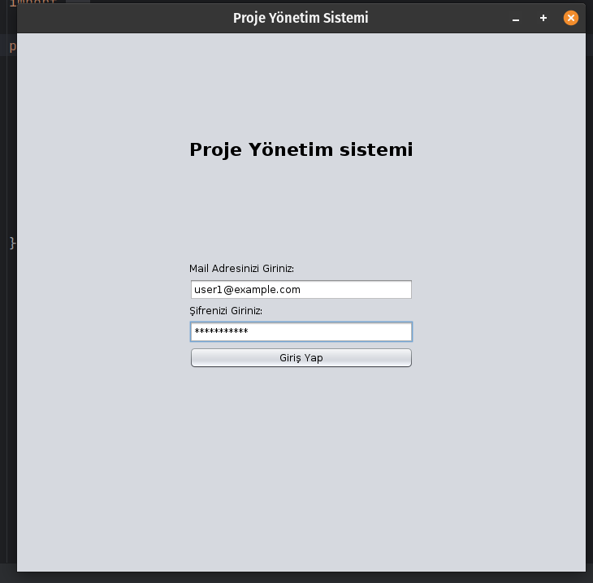
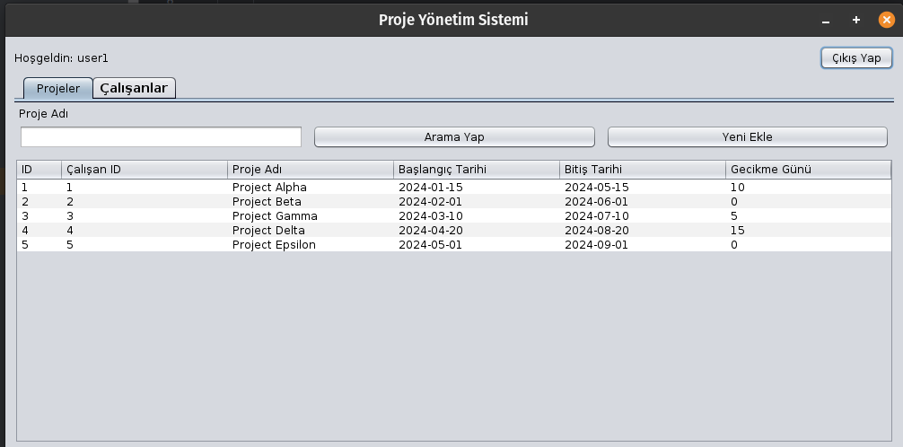
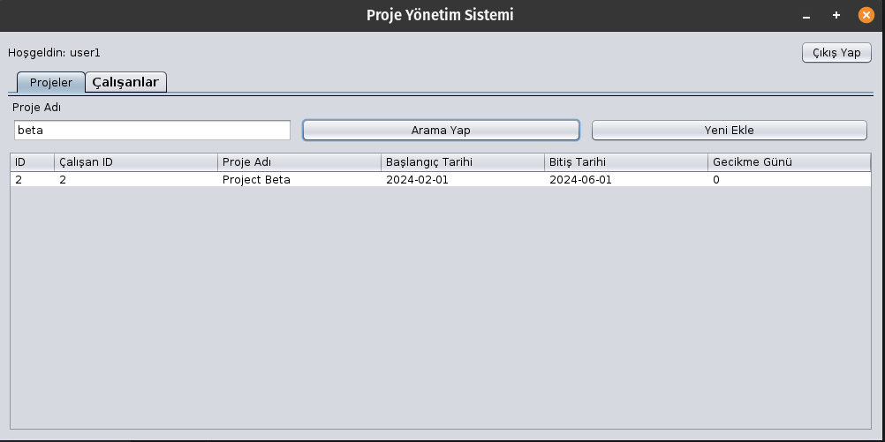
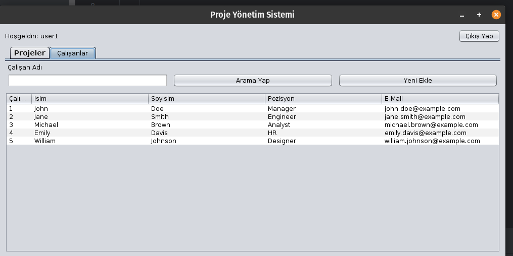
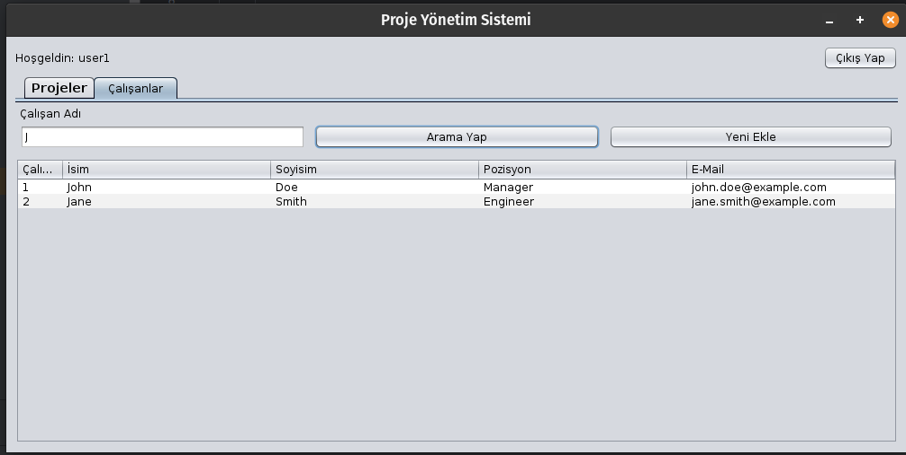
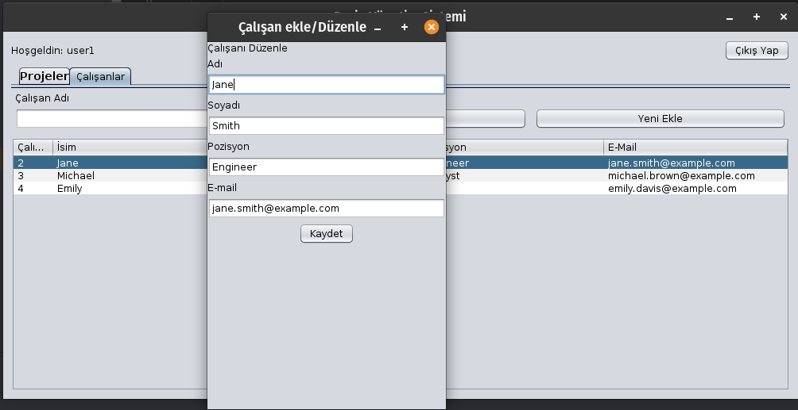
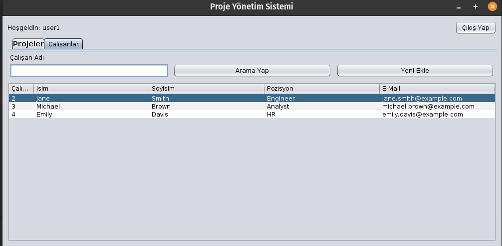
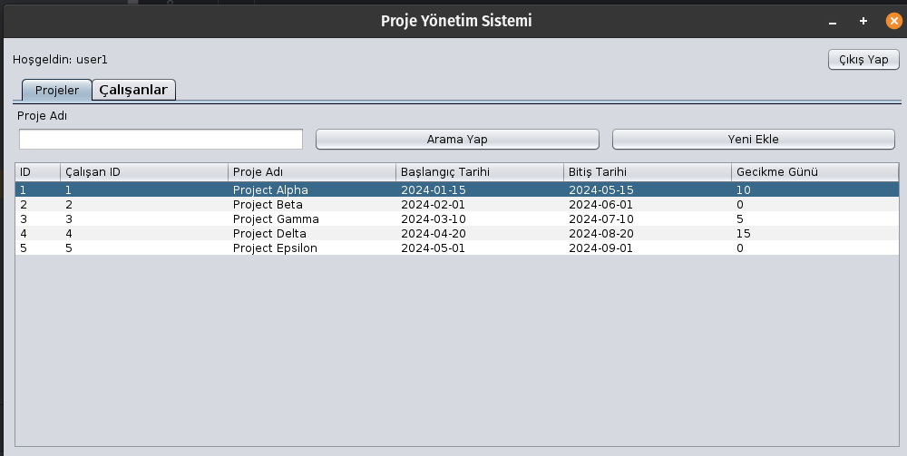
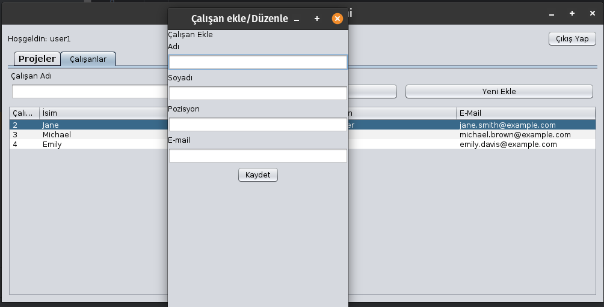
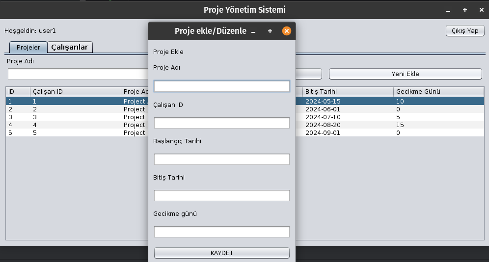
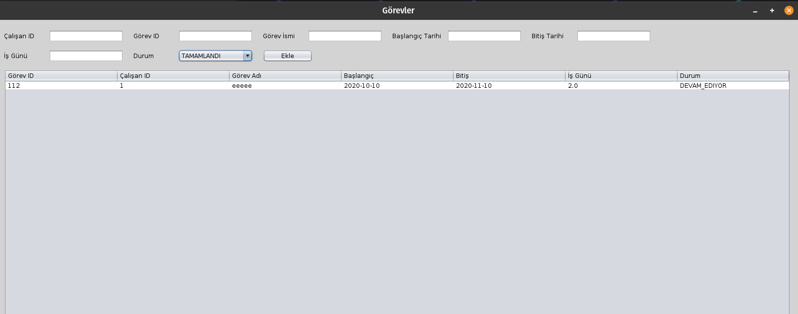
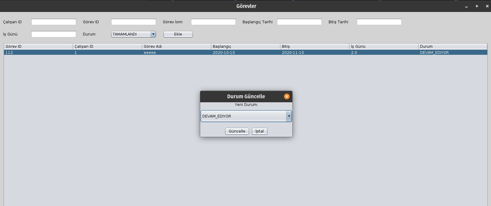
</p>

## Özellikler

- **Proje Yönetimi:**  
  - Proje oluşturma, düzenleme ve silme.  
  - Proje başlangıç ve bitiş tarihlerini belirleme.  

- **Görev Yönetimi:**  
  - Görev ekleme, düzenleme ve çalışanlara atama.  
  - Görevlerin başlangıç tarihi, bitiş tarihi ve durum bilgisi (Tamamlanacak, Devam Ediyor, Tamamlandı).  

- **Çalışan Yönetimi:**  
  - Çalışan ekleme, düzenleme ve silme.  
  - Çalışanların tamamladığı, devam eden ve başlayacak görevlerini görüntüleme.   

- **Kullanıcı Dostu Arayüz:**  
  - Proje ve görev yönetimi için kolay ve anlaşılır bir kullanıcı arayüzü.  
  - Çalışan ve görev detaylarını görüntüleme.  

---

## Kurulum

1. **Proje Dosyalarını İndir:**  
   Bu projeyi bilgisayarınıza klonlayın:  
   ```bash
   git clone https://github.com/username/ProjectManagementApp.git
   cd ProjectManagementApp
   ```

2. **Veritabanını Ayarla:**  
   - MySQL'de bir veritabanı oluşturun.  
   - `core/DatabaseConnection.java` dosyasındaki veritabanı bağlantı bilgilerini güncelleyin.  

3. **Projeyi Çalıştır:**  
   - IDE'nizde `Main.java` dosyasını çalıştırarak projeyi başlatın.  

---

## Dosya Yapısı

- **Business:** İş mantığı sınıfları (Controller).  
- **core:** Veritabanı bağlantısı ve yardımcı sınıflar.  
- **dao:** Veritabanı erişim sınıfları.  
- **entity:** Proje, görev, çalışan gibi temel varlıklar.  
- **view:** Kullanıcı arayüzü dosyaları (Swing formları ve Java sınıfları).  

---

## Gereksinimler

- Java JDK 8 veya üzeri  
- MySQL Veritabanı  
- Bir IDE (Örneğin IntelliJ IDEA veya Eclipse)  

---

## Lisans

Bu proje MIT Lisansı ile lisanslanmıştır. Daha fazla bilgi için `LICENSE` dosyasına bakabilirsiniz.  

--- 
